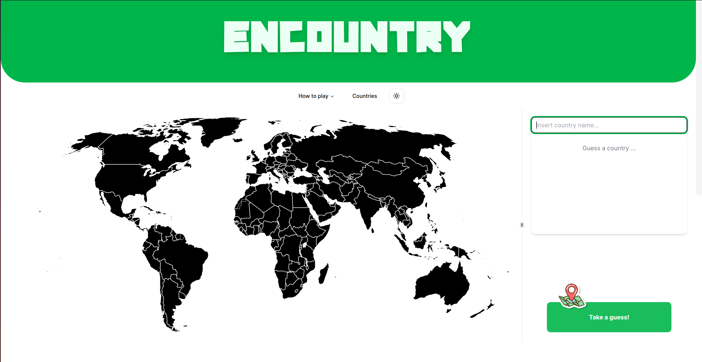

# Encountry

#### Realizado por:
- Francisca Barros PG53816
- Rafael Correia PG54162
- Robert Szabo PG54194

## Introdução
Para o trabalho de RPCW optamos por fazer um tema livre, pois acreditamos que isso nos permitiria ter um produto final mais interessante e mais aperfeiçoado, já que seria algo que nos interessaria mais. Para este projeto tivemos inspiração em múltiplos outros jogos, como o Geoguessr, um jogo aonde vês uma imagem retirada do google maps e tens que advinhar aonde estás no mundo e jogos como Wordle, regexcrossword e PokeDoku, que são jogos que tentas advinhar respostas a partir de pistas dadas.

Com isto, decidimos fazer um jogo aonde tentarias advinhar o país consuante pistas como o GDP e a população. Procuramos se já exestia algo e deparamos por um jogo com esta ideia, o countryle. Como achamos que podíamos fazer um melhor produto, decidimos atacar este tema.

No countryle, nós vimos que eles só tinham 5 temas que nunca mudavam: Hemisfério, Continente, Temperatura média, população e coordenadas. Nós achamos que só com estas opções o jogo ficaria aborrecido, por isso decidimos criar uma ontologia com informações variadas de todos os países do mundo para melhorar a experiência do jogo. 

## Ontologia

Para a ontologia, tivemos de delimitar o que consideramos que é um país. Baseamos a nossa definição no que as Nações Unidas consideram um país. Esta decisão foi importante e difícil, porque não há um consenso na defenição de país. No final, consideramos 195 países, ao usar a defenição das Nações Unidas, isto habelitou-nos a retirar muitos "países" que não têm muitos dados disponíveis, como províncias Francesas e Inglesas.

A ontologia neste momento é muito básica, mas com possibilidade para expandir no futuro, por exemplo: acrescentar cidades também e não só países. Para a entrega final a ontologia só possui uma classe: País e essa classe possui os seguintes atributos:

- **longitude**
- **receita_imposto** : % de imposto no país, ex.: 22.80%
- **taxa_de_natalidade** : relação entre os nascimentos em um ano e o número total da população.
- **latitude**
- **temperatura_media**
- **hemisferio**
- **capital**
- **taxa_de_mortalidade** 
- **taxa_fertilidade** : número médio de filhos que uma mulher tem ao longo da vida
- **exportacoes**
- **area** : area de um país em Km^2^
- **emissoes_co2** : quantos milhões de toneladas de CO2 um país emite por toneladas por capita
- **costa** : costa por area do país
- **telefones_por_1000** 
- **moeda** : a moeda que é usada no país
- **taxa_desemprego** : % de desemprego num país
- **importacoes**
- **lado_em_que_conduz**
- **migracao_liquida**
- **espetativa_de_vida**
- **medicos_por_mil**
- **gdp** : valor monetário total de todos os bens e serviços produzidos de um país num ano. 
- **literacia** : % de literacia num país
- **mortalidade_infantil**
- **densidade_populacional**
- **populacao**
- **racio_sexos** : quantos homens existem para 100 mulheres
- **flag** : link para uma imagem da bandeira do país
- **continente**

Para obter a informação necessária para ontologia, extraímos informações de múltiplos sítios.

Inicialmente procurámos datasets sobre o mundo e deparamos por alguns. Decidimos por usar os seguintes datasets:

- [Countries of the world - bnokoro](https://github.com/bnokoro/Data-Science/blob/master/countries%20of%20the%20world.csv)
- [Countries of the World 2023 - nelgiriyewithana](https://www.kaggle.com/datasets/nelgiriyewithana/countries-of-the-world-2023)
- [undata country profiles - sudalairajkumar](https://www.kaggle.com/datasets/sudalairajkumar/undata-country-profiles)
- [Countries of the World - fernandol](https://www.kaggle.com/datasets/fernandol/countries-of-the-world)

De seguida, tentámos usar dbpedia, mas infelizmente tinha muito lixo e não podemos usar muita dessa informação.

Por fim, usamos webscraping para certas informações, como por exemplo: para ter as bandeiras dos países, usámos webscraping nesta [página](https://www.worldometers.info/geography/flags-of-the-world/) e para ter as temperaturas médias usámos esta [página](https://en.wikipedia.org/wiki/List_of_countries_by_average_yearly_temperature) e por fim para obter os continentes obtemos a informação [aqui](https://simple.wikipedia.org/wiki/List_of_countries_by_continents).

Infelizmente, houve sempre certas informações que escapavam as nossas scripts e para essas informações só as colocámos manualmente, que sempre assim era mais facil ver o que era lixo e o que era informação pertinente.

## Back-end

## Front-end

## Conclusão
Achamos que temos um trabalho satisfatório e cumprimos os objetivos que queríamos alcançar. Além disso, criámos um projeto com potencial de expansão, como, por exemplo, adivinhar cidades dentro de um determinado país. Desenvolvemos uma ontologia com informações variadas e detalhadas sobre todos os países e acreditamos que o front-end está bastante elegante e funcional.
## Screenshots

